# Bunny Hop Memory

## Milestone Project -02 - _Interactive Front End Development_ - Code Institute

Bunny Hop Memory is a charming memory game where players guide a rabbit through a garden, collecting carrots while avoiding traps and outsmarting the watchful dog.This game can play any user without any age limites.

## User Experience

### User Stories

+ As a player, I want to see a grid of face-down cards containing images of carrots, traps, and a dog on the back of each card when I start the game.

+ As a player I want to flipped 2 cards at a time.
+ As a player, I want to earn points when I flip over two matching cards with images of carrots and lose points when I flip over two matching cards with trap images.
+ As a player I must lose the game if I Select a card with dog image.
+ As a player, I expect the game to end immediately if I select a card with a dog image, resulting in a loss.
+ As a player, I want to play continuously until the rabbit reaches its hole, unless I lose.
+ As a player, I want the game to have levels and a total score, and I want these to be visible at all times
+ As a player,I want to see the number of movements and the time it takes to complete the game, allowing me to track how many movements and how much time it took to win the game.
+ As a player, I want to reset the game at anytime during play.
+ As a player, I want the game to have animations, a visually appealing design, sound effects, and responsiveness across all devices.
+ As a player, I want the game to be enjoyable, strategic, challenging, and to encourage the use of memory skills.

### Design

#### Colour Scheme

I used a color space to select a color palette for the game, which is generated based on the background color. I primarily applied these colors to the cards and buttons within the feedback modal.

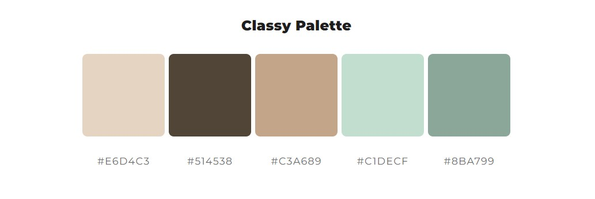

#### Typography

### Wireframes

[Landing page Mobile](./assets/readme/wireframes/landing-mobile.jpg)

[Landing page Tablet](./assets/readme/wireframes/landing-tablet.jpg)

[Landing page Desktop](./assets/readme/wireframes/landing-desktop.jpg)

[Game page Mobile](./assets/readme/wireframes/game-mobile.jpg)

[Game page Tablet](./assets/readme/wireframes/game-tablet.jpg)

[Game page Desktop](./assets/readme/wireframes/game-desktop.jpg)

[Help](./assets/readme/wireframes/help.jpg)

## Features

### Existing Features

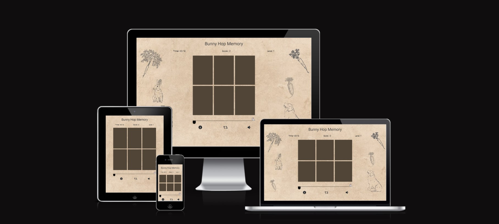

1. **Play button on the welcome screen:**
   + The feature of the play button is to start the game.
 
    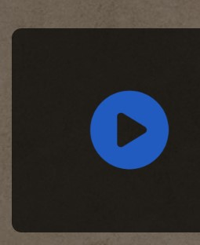

2. **Info button on the welcome screen:**
   + The feature of this button is to provide information on how to play the game.
  
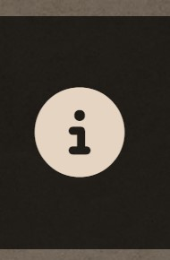

3. **Exit button on the welcome screen:**
   + Clicking this button allows you to exit the game.
 
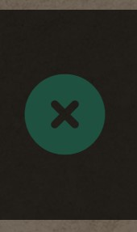

4. **Timer on the game page:**
   + This displays how long you have been playing the game.
 
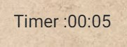

5. **Score on the game page:**
   + It shows your current score as you progress in the game.
 
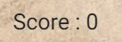

6. **Level on the game page:**
   + It indicates which level you are currently on.
   
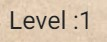

7. **Game grid:**
   + The game grid displays playing cards. When you click on a card, it flips. If it's a match, it stays flipped; otherwise, it flips back.
   
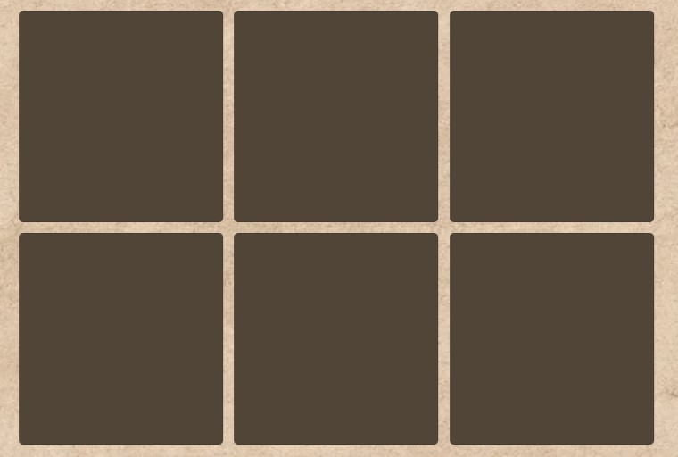

8. **Info button on the game page:**
   + This button provides instructions on how to play the game.
  
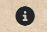

9. **Restart button on the game page:**
   + Clicking this button restarts the game.

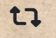

10.  **Sound button on the game page:**
    + You can use this button to turn sounds on or off.
   
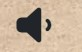

11.  **Path for the bunny on the game page:**
    + The bunny moves along this path as you progress in the game. When you win, the bunny reaches its hole.
  
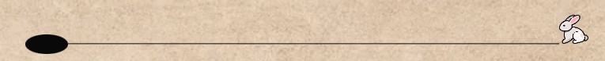

### Future Features

1. I wanto add a feature which will allow to add users to database with a username and password.
2. I want add a feature that user can save their game.
3. I want add sound effects for animation of the game.
4. Add a high score leader board to the game to allow the user to add their name and record the moves and time.
5. I want to add a more levels to the game then it will be harder in higher levels.

## Technologies Used

+ Google Chrome Dev tools for debugging
+ Google Lighthouse for audits
+ Git source control
+ VS Code as IDE
+ CodeAnywhere as online integrated development environment (IDE)
+ W3C validator used for HTML validating
+ Jigsaw Validator used for CSS validation
+ JSHint used for Java Script validation
+ Color space for color selection
+ Canva for background image editing

### Languages Used

+ HTML5
+ CSS3
+ Java Script

### Frameworks Libraries and Programmes Used

+ Bootstrap v4.6.2
+ jquery 3.6.4
+ Font Awsome
+ moment.js

## Testing

### Validator Testing

Validation is done throughout the development and all the error and warnings are fixed.

following validators have been used to validate HTML and CSS codes.

### [<em>HTML Validator</em>

+ [W3C validator](https://validator.w3.org/) used for HTML validating

### <em>CSS Validator</em>

+ [CSS validation](https://jigsaw.w3.org/css-validator/) used for CSS validation

### <em>Java Script Validator</em>

+ [JSHint Validator](https://jshint.com/) used for CSS validation

### Testing Accessibility and Performance

I used google lighthouse to check Accessibility and Performance.

|                    | Performance | Accessibility | Best Practices | SEO |
| ------------------ | ----------- | ------------- | -------------- | --- |
| [Desktop view](./assets/testing/lighthouse-desktop.jpg)      | 99%         | 100%          | 100%           | 90% |
| [Mobile view](./assets/testing/lighthouse-mobile.jpg)       | 84%         | 100%          | 100%           | 92% |

### Responsiveness

### Testing User Stories

### Problems Encountered

## Deployment

### Deployment through GitHub Pages

## Credits

### Code

1. Feedback modal icons, and footer icons were taken from Font Awesome.
2. Bootstrap framework used for modal, flex box and responsiveness throughout the website.
3. Google Fonts used in the website (Roboto & Exo)
4. moment.js library used for timer functions.
5. jQuery library used throughout the code.
6. w3schools was used as a general source of knowledge
7. youtube inspiration was taken for some sections.

### Media

 for background audio
 for favicon icon
 for image of cards

### Acknowledgements

+ Creating a README(How to put together a well-documented README for your projects) by Code Institute
+ I would like to acknowledge my mentor Rory Patrick for his review and valuable feedback throughout the project.
+ I would like to thank my wife for testing the game and feedback.
