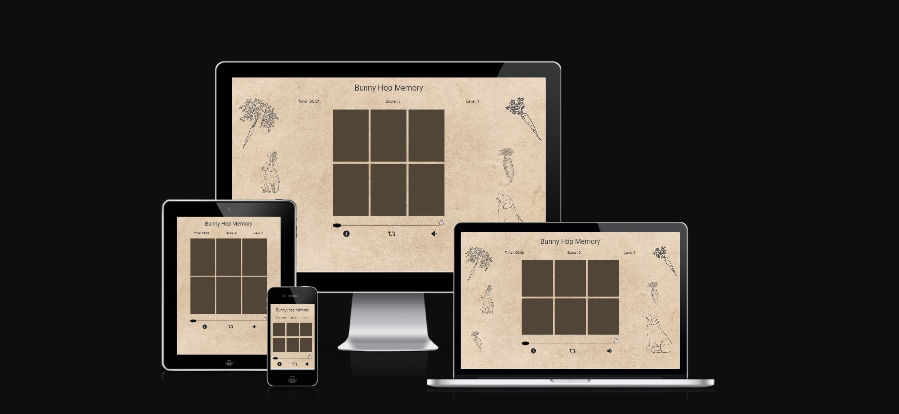

# Bunny Hop Memory

## Milestone Project -02 - _Interactive Front End Development_ - Code Institute

Bunny Hop Memory is a charming memory game where players guide a rabbit through a garden, collecting carrots while avoiding traps and outsmarting the watchful dog. This game can be played by any user without any age limits.

## User Experience

### User Stories

+ As a player, I want to see a grid of face-down cards containing images of carrots, traps, and a dog on the back of each card when I start the game.

+ As a player, I want to flip 2 cards at a time.
+ As a player, I want to earn points when I flip over two matching cards with images of carrots and lose points when I flip over two matching cards with trap images.
+ As a player I must lose the game if I Select a card with a dog image.
+ As a player, I expect the game to end immediately if I select a card with a dog image, resulting in a loss.
+ As a player, I want to play continuously until the rabbit reaches its hole unless I lose.
+ As a player, I want the game to have levels and a total score, and I want these to be visible at all times.
+ As a player, I want to see the number of movements and the time it takes to complete the game, allowing me to track how many movements and how much time it took to win the game.
+ As a player, I want to reset the game at any time during play.
+ As a player, I want the game to have animations, a visually appealing design, sound effects, and responsiveness across all devices.
+ As a player, I want the game to be enjoyable, strategic, and challenging, and to encourage the use of memory skills.

### Design

##### Game Objective

The objective of Bunny Hop Memory is to guide a bunny safely to its home while playing a memory card game. player needs to match pairs of carrot cards to earn points while avoiding traps and dog cards. The game consists of multiple levels, and the player's goal is to successfully complete all levels.

##### Game Elements

**Cards:** The game is primarily played with a set of cards. Each card can be one of three types: carrot, trap, or dog.

_Carrot Cards:_ Matching pairs of carrot cards earns the player 10 points.
_Trap Cards:_ Matching trap cards results in a loss of 5 points.
_Dog Cards:_ Selecting a dog card ends the game, and the player loses.

**Timer:** There's a timer displayed on the screen to keep track of the time the player spends playing the game.

**Score:** The player's current score is displayed on the screen. The player earns points by matching carrot cards and loses points for matching trap cards.

**Levels:** The game consists of multiple levels, each with an increasing number of cards. The player needs to complete each level to progress in the game.

**Rabbit Path:** A visual representation of the bunny's progress is shown on a path. As you complete levels, the bunny moves closer to its home.

#### Colour Scheme

I used a color space to select a color palette for the game, which is generated based on the background color. I primarily applied these colors to the cards and buttons within the feedback modal.

#### Typography

I used the Roboto and Exo Google fonts for this game. Roboto is used for the game title, while Exo is used for the status bar texts and information texts in the modals.

### Wireframes

[Landing page Mobile](./assets/readme/wireframes/landing-mobile.jpg)

[Landing page Tablet](./assets/readme/wireframes/landing-tablet.jpg)

[Landing page Desktop](./assets/readme/wireframes/landing-desktop.jpg)

[Game page Mobile](./assets/readme/wireframes/game-mobile.jpg)

[Game page Tablet](./assets/readme/wireframes/game-tablet.jpg)

[Game page Desktop](./assets/readme/wireframes/game-desktop.jpg)

[Help](./assets/readme/wireframes/help.jpg)

## Features

### Existing Features

1. **Play button on the welcome screen:**
   + The feature of the play button is to start the game.

    

2. **Info button on the welcome screen:**
   + The feature of this button is to provide information on how to play the game.
  

3. **Exit button on the welcome screen:**
   + Clicking this button allows you to exit the game.

4. **Timer on the game page:**
   + This displays how long you have been playing the game.

5. **Score on the game page:**
   + It shows your current score as you progress in the game.

6. **Level on the game page:**
   + It indicates which level you are currently on.

7. **Game grid:**
   + The game grid displays playing cards. When you click on a card, it flips. If it's a match, it stays flipped; otherwise, it flips back.

8. **Info button on the game page:**
   + This button provides instructions on how to play the game.
  

9. **Restart button on the game page:**
   + Clicking this button restarts the game.

10. **Sound button on the game page:**
    + You can use this button to turn sounds on or off.

11. **Path for the bunny on the game page:**
    + The bunny moves along this path as you progress in the game. When you win, the bunny reaches its hole.
  

### Future Features

1. I want to add a feature that will allow to add users to the database with a username and password.
2. I want to add a feature that user can save their game.
3. I want to add sound effects for the animation of the game.
4. Add a high-score leaderboard to the game to allow the user to add their name and record the moves and time.
5. I want to add more levels to the game then it will be harder in higher levels.

## Technologies Used

+ Google Chrome Dev tools for debugging
+ Google Lighthouse for audits
+ Git source control
+ VS Code as IDE
+ CodeAnywhere as an online integrated development environment (IDE)
+ W3C validator used for HTML validation
+ Jigsaw Validator used for CSS validation
+ JSHint used for Java Script validation
+ Color space for color selection
+ Canva for background image editing

### Languages Used

+ HTML5
+ CSS3
+ Java Script

### Frameworks Libraries and Programmes Used

+ Bootstrap v4.6.2
+ jquery 3.6.4
+ Font Awesome
+ moment.js

## Testing

### Validator Testing

Validation is done throughout the development and all the error and warnings are fixed.

following validators have been used to validate HTML and CSS codes.

### <em>HTML Validator</em>

+ [W3C validator](https://validator.w3.org/) used for HTML validating

### <em>CSS Validator</em>

+ [CSS validation](https://jigsaw.w3.org/css-validator/) used for CSS validation

### <em>Java Script Validator</em>

+ [JSHint Validator](https://jshint.com/) used for CSS validation

### Testing Accessibility and Performance

I used google lighthouse to check Accessibility and Performance.

|                    | Performance | Accessibility | Best Practices | SEO |
| ------------------ | ----------- | ------------- | -------------- | --- |
| [Desktop view](./assets/testing/lighthouse-desktop.jpg)      | 99%         | 100%          | 100%           | 90% |
| [Mobile view](./assets/testing/lighthouse-mobile.jpg)       | 84%         | 100%          | 100%           | 92% |

### Responsiveness

The game is designed to be responsive and optimized for all devices, including mobile phones, tablets, and desktop computers.

1. Landing Page: The home page includes a feedback modal to click start, how to play or exit from the game.

    Desktop view

    

    Tablet view

    

    Mobile view

    

2. Game Page: The game page includes card grid controls and status bar and the title.

    Desktop view

    

    Tablet view

    

    Mobile view

    

3. Info Page: The info page includes how to play the game and other instructions needed to play the game.

    Desktop view

    

    Tablet view

    

    Mobile view

    

### Testing User Stories

As a user/player, I see most of the user stories are satisfied

+ As a player, I can see a grid of face-down cards containing images of carrots, traps, and a dog on the back of each card when I start the game.
+ As a player I can flip 2 cards at a time.
+ As a player, I earn points when I flip over two matching cards with images of carrots and lose points when I flip over two matching cards with trap images.
+ As a player, I see the game end immediately if I select a card with a dog image, resulting in a loss.
+ As a player, I can play continuously until the rabbit reaches its hole unless I lose.
+ As a player, I can see that the game has levels and a total score, and I want these to be visible at all times in the status bar.
+ As a player, I can see how much time it took to win the game in the status bar.
+ As a player, I can reset the game at any time during the play restart button in the controls.
+ As a player, I see the game to have animations, a visually appealing design, sound effects, and responsiveness across all devices.
+ As a player, I see the game to be enjoyable, strategic, and challenging, and to encourage the use of memory skills.

However the following user story has not been addressed because I deemed it unimportant, and it may vary from one game to another.

+ As a player I can see the number of movements I have done

### Problems Encountered

While I was developing the game I encountered several bugs. However, I identified main 3 bugs that are critical for the game.

1. **Can flip cards while checking for a match.**

When testing the game, I discovered a bug where clicking four cards in a row without any breaks between card pairs would cause the fourth card to remain flipped. To debug this issue, I needed to prevent flipping while the `checkForMatch` function was running.

To achieve this, I introduced a `checkingForMatch` variable and set its value to `false`. Here's how it works:

1. When a player flips two cards, the variable's value is set to `true` (indicating that a check is in progress).

2. The `checkForMatch` function runs. If it's not a match, the variable's value is set to `false`, allowing a new check to begin.

3. Even if it's a match but not all cards have been found yet, the variable's value is set to `false`. In other words, if there are more cards to check, the process stops to run a new check.

4. At the end of the shuffle function, the variable's value is changed to `false`, ensuring that a new check can be initiated.

5. Importantly, if the variable is `true` when the player tries to flip another card, the `flipCard` function will terminate early and return, preventing further flips.

6. Additionally, I made another change: earlier, the `flippedCards` array was reset to empty outside of the `if` block where pairs were matched. Now, I've moved it inside the `if` block. This means that only when pairs are matched will the `flippedCards` array transform into an empty array.

2. **Can flip more than 2 cards at a time.**

I encountered an issue where players could flip more than two cards at a time in the game. To handle this situation, I needed to control when players were allowed to click on cards. I realized that this control should be implemented after loading the images and flipping back all the cards (in the 'assignRandomImages' function) and also after a player clicks the first card. Clicking on any other card should be disabled until the 'checkForMatch' function has completed. Furthermore, clicking should be avoided when the game is over until it restarts and all the cards are flipped back.

To address this, I declared a variable called 'canClick' and initially set its value to 'false.' Then, at the end of the 'assignRandomImages' function, I changed its value to 'true.' Subsequently, when a player flips two cards, I set the variable's value back to 'false.' However, in my previous code, I failed to check the variable's value before allowing a flip. During debugging, I added this check, ensuring that the 'flip' function only works if the variable's value is 'true.'

 

One other mistake I made was changing the variable's value to 'true' in the middle of the 'checkForMatch' function. I corrected this by moving it to the end of the function.

 

3. **Can flip cards while loading the cards at the start of a level.**

I identified a bug during my game testing phase where players could flip cards while the cards were still loading at the start of a level. To address this issue, I introduced an 'isInitial' variable.

At the beginning of the game, the variable's value is set to 'true.' It remains 'true' until all the cards have been loaded at the start of a level and flipped back (in other words, at the end of the 'assignRandomImages' function).

Furthermore, the 'isInitial' variable is set to 'true' again when moving to the next level, which occurs if the 'checkAllCarrotCardsFlipped' function returns 'true' in the 'checkForMatch' function.

Now, if a player attempts to flip a card before all the cards have been flipped back, the 'flip' function will be halted by checking the 'isInitial' variable. If the value is 'true,' the 'flip' function will return without executing any further lines of code within the 'flip' function.

## Deployment

### Deployment through GitHub Pages

GitHub pages were used to deploy the site. Selected the master Branch from the source section drop-down menu by navigating the settings tab in the GitHub repository. The detailed ribbon appeared and the page was automatically refreshed with successful deployment.

The live link can be found here: <https://hpatnadeeshan.github.io/MS-2>

### Deployment locally

clone or download the website repository as a zip file or GitHub desktop method. Open the directory through an IDE and Run the website on a local server.

## Credits

### Code

1. Feedback modal icons and footer icons were taken from Font Awesome.
2. Bootstrap framework used for modal, flexbox and responsiveness throughout the website.
3. Google Fonts used in the website (Roboto & Exo)
4. moment.js library used for timer functions.
5. jQuery library used throughout the code.
6. w3schools was used as a general source of knowledge
7. YouTube inspiration was taken for some sections.

### Media

1. [Tunetank](https://tunetank.com/) for background audio
2. [Pixabay](https://pixabay.com/) for favicon icon
3. [flaticon](https://www.flaticon.com/) for image of cards

### Acknowledgements

+ Creating a README(How to put together a well-documented README for your projects) by Code Institute
+ I would like to acknowledge my mentor Rory Patrick for his review and valuable feedback throughout the project.
+ I would like to thank my wife for testing the game and feedback.
